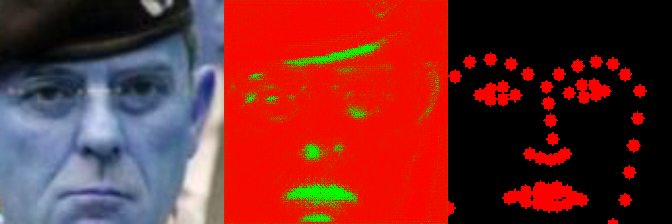

#### Deep(er) look into Facial landmarks detection-A semantic segmentation based approach.

##### Status: Had to take a break, USFA folks arriving today. At epoch 21/30

###### Key dependencies:

1. pytorch
2. [dlib](https://pypi.org/project/dlib/)
3. [opencv3](https://anaconda.org/conda-forge/opencv)

##### Overview

1. [Dataset Creation](https://github.com/KaunilD/facs-segmentation/blob/master/dataset-creation/csv2png_lfw.py):
   1. Facial (uncropped and unaligned) images obtained from LFW dataset (ds).
   2. 64 Landmarks for each of the images from ds the have been extracted using [dlib](http://dlib.net/) library.
2. [Model Training](https://github.com/KaunilD/facs-segmentation/blob/master/deep-learning/trainer.py):
   1. Pairs of images (grayscale) and their respective landmark masks are input to the condensed [SegNet](https://arxiv.org/abs/1511.00561) model for pixel level segmentation.
   2. [Condensed implementation]() has fewer layers and smaller filter sizes to prevent overfitting of a relatively lower dimensional dataset as compared to the one discussed in original implementation.

###### Initial Results: Epoch 21

| output                                   |
| ---------------------------------------- |
|  |
|  |
|  |
|  |
|  |
